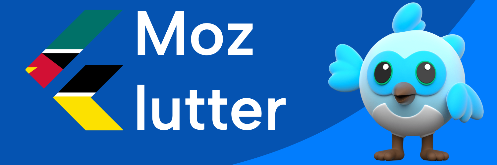

<strong> Read this guide in English </strong>

    <ul>
        <li><a href="./../README-EN.md"> English </a></li>
    </ul>

# Comunidade MozFlutter

Bem-vindo(a) à **MozFlutter**, a comunidade Flutter de Moçambique.

Este repositório serve como **ponto central** da comunidade, contendo informações sobre quem somos, como participar, projetos activos e como contribuir.

## O que é a MozFlutter?

A **MozFlutter** é uma comunidade aberta de desenvolvedores, estudantes e entusiastas de Flutter em Moçambique, criada para:

- Partilhar conhecimento sobre Flutter e Dart
- Conectar desenvolvedores, estudantes e empresas
- Construir projectos práticos e reais
- Promover eventos, workshops e meetups
- Apoiar novos membros no ecossistema mobile

Todos são bem-vindos, independentemente do nível de experiência.

## Como participar

1. Dá uma estrela nos repositórios da comunidade
2. Entra nos canais oficiais
3. Explora os projectos disponíveis
4. Escolhe uma issue marcada como `good first issue`
5. Contribui através de **Fork + Pull Request**

## Contribuições

Adoramos contribuições! 💙
Antes de começares, por favor lê:

- [Contribuição](./../CONTRIBUTING.md)
- [Código de Conduta](./../CODE_OF_CONDUCT.md)

Contribuições podem ser:

- Código
- Documentação
- Exemplos
- Tutoriais
- Sugestões e ideias

<!-- ## Estrutura da comunidade

Alguns repositórios que encontrarás:

- `community` → informações centrais
- `.github` → templates e padrões
- `awesome-flutter-mz` → recursos Flutter em Moçambique
- `labs-*` → tutoriais práticos
- `starter-*` → templates Flutter
- `projects-*` → projetos comunitários -->

## Emails de contacto

- **Contacto/ Parcerias:** mozflutter.contact@gmail.com
- **Informações/ Dúvidas:** mozflutter.info@gmail.com
- **Media/ Imprensa:** mozflutter.social@gmail.com
- **Eventos/ Meetups:** mozflutter.events@gmail.com
- **Colaborações/ Contribuições:** mozflutter.tech@gmail.com

## Canais Oficiais

- **GitHub:** https://github.com/mozFlutter
- **WhatsApp:** https://chat.whatsapp.com/LDCa69V6G6m2EPvHlLEjiz
- **LinkedIn:** https://www.linkedin.com/company/fluttermoz/
- **Instagram:** https://www.instagram.com/mozflutter
- **Twitter:** https://x.com/mozflutter
- **TikTok:** https://www.tiktok.com/@mozflutter
- **Facebook:** https://www.facebook.com/flutterMoz
- **Telegram:** https://t.me/FlutterMoz
  <!-- - **Discord:** https://discord.gg/mozflutter -->
  <!-- - **YouTube:** https://www.youtube.com/@mozflutter -->

## Código de Conduta

A MozFlutter é uma comunidade **aberta, inclusiva e respeitosa**.  
Todos os membros devem seguir o nosso [Código de Conduta](./../CODE_OF_CONDUCT.md).

## Vamos construir juntos

Se gostas de Flutter, mobile e comunidade, **este é o teu lugar**.

Bem-vindo(a) à **MozFlutter**!💙
